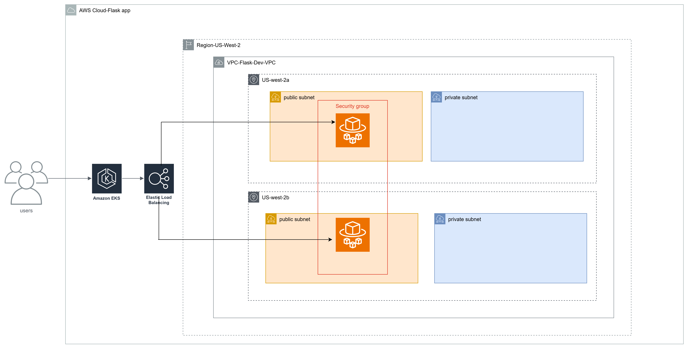

# 🚀 Flask Application Deployment on AWS EKS

This project automates the deployment of a **Flask application** on **Amazon EKS (Elastic Kubernetes Service)**, using **Terraform** to provision all infrastructure components. The Flask app is containerized with Docker, stored on Docker Hub, and exposed via a **Kubernetes LoadBalancer service**.

GitHub Repository: [https://github.com/Nnamdi92/Flask-Eks-Infra.git](https://github.com/Nnamdi92/Flask-Eks-Infra.git)

---

## 📁 Architecture Diagram

![Infrastructure Diagram]!

🔗 View diagram in Draw.io: [Click here](https://app.diagrams.net/)

This diagram illustrates the EKS-based deployment, including:
- VPC with public subnets
- Internet Gateway and route tables
- EKS Cluster with managed node groups
- Flask app deployed via Kubernetes
- External access through a LoadBalancer service

---

## 🌐 Application Endpoints

| Endpoint     | Method | Description                           |
|--------------|--------|---------------------------------------|
| `/`          | GET    | Returns “Welcome to my flask application” |
| `/health`    | GET    | Returns app health status as JSON     |

Live Example:

```bash
curl http://a5699f88b121d4af29a2658e7ca46de8-1656373924.us-west-2.elb.amazonaws.com/
# → "Welcome to my flask application"

curl http://a5699f88b121d4af29a2658e7ca46de8-1656373924.us-west-2.elb.amazonaws.com/health
# → { "status": "healthy" }
```

---

## 🔧 Tech Stack

- **Terraform** (Infrastructure as Code)
- **Amazon EKS** (Managed Kubernetes)
- **AWS VPC & Subnets**
- **IAM Roles & Security Groups**
- **Docker & Docker Hub**
- **Flask + Gunicorn**

---

## ⚙️ Setup & Deployment

### 1️⃣ Prerequisites

Make sure you have these installed:
- [AWS CLI](https://docs.aws.amazon.com/cli/)
- [kubectl](https://kubernetes.io/docs/tasks/tools/)
- [Terraform](https://developer.hashicorp.com/terraform/downloads)
- [Docker](https://www.docker.com/)

### 2️⃣ Clone the Repository

```bash
git clone https://github.com/Nnamdi92/Flask-Eks-Infra.git
cd Flask-Eks-Infra
```

### 3️⃣ Tag and Push Your Docker Image

```bash
docker tag my-flask-app:latest nnamdi92/my-flask-app:latest
docker push nnamdi92/my-flask-app:latest
```

### 4️⃣ Deploy Infrastructure with Terraform

```bash
terraform init
terraform apply
```

### 5️⃣ Update kubeconfig and Deploy Flask App

```bash
aws eks --region us-west-2 update-kubeconfig --name my-eks-cluster
kubectl apply -f kubernetes_deployment.yaml
kubectl apply -f kubernetes_service.yaml
```

---

## 🔐 Security Review

### ✅ Current Configuration:
- Port 5000 is publicly exposed via Security Group (`0.0.0.0/0`)
- Kubernetes LoadBalancer service exposes the app externally
- IAM roles follow AWS recommended EKS and EC2 policies

### ⚠️ Recommendations:
- Restrict ingress to known IPs or use a private subnet with Ingress Controller
- Terminate SSL via ALB with HTTPS using ACM certificates
- Enable CloudTrail and GuardDuty for enhanced visibility
- Ensure least privilege is used for IAM roles

---

## 📢 Verifying the Deployment

```bash
kubectl get svc flask-lb-service
```

Or visit directly:

- [http://a5699f88b121d4af29a2658e7ca46de8-1656373924.us-west-2.elb.amazonaws.com/](http://a5699f88b121d4af29a2658e7ca46de8-1656373924.us-west-2.elb.amazonaws.com/)
- [http://a5699f88b121d4af29a2658e7ca46de8-1656373924.us-west-2.elb.amazonaws.com/health](http://a5699f88b121d4af29a2658e7ca46de8-1656373924.us-west-2.elb.amazonaws.com/health)

---

## 📌 Clean Up

To delete all deployed resources:

```bash
terraform destroy
```

---

## 📄 License

MIT License. See `LICENSE` file for details.
